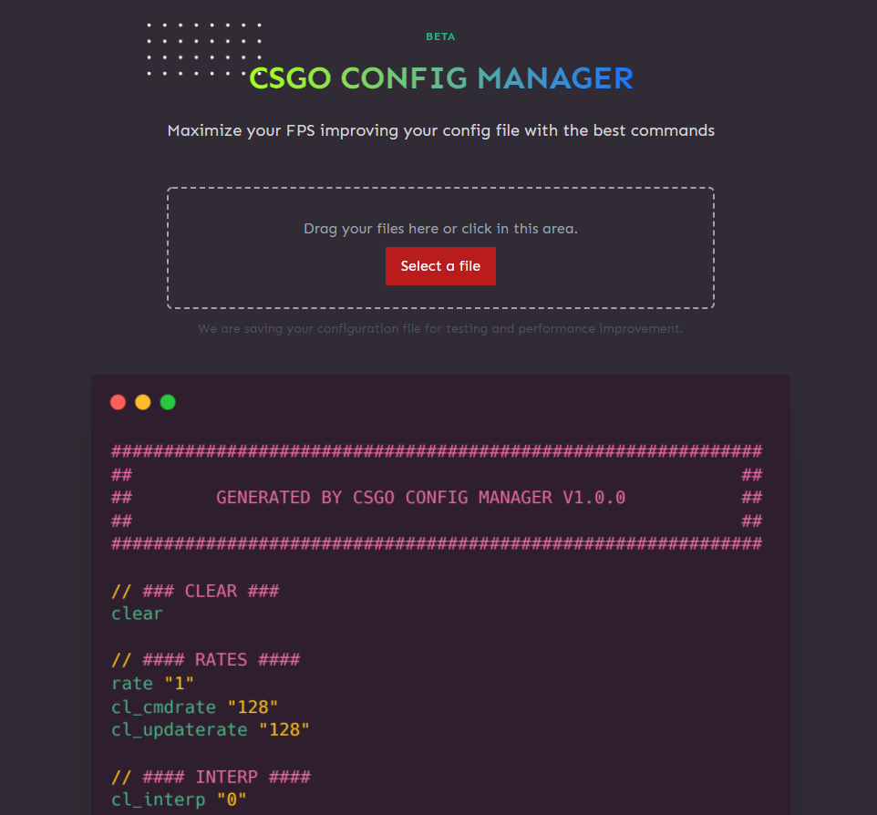
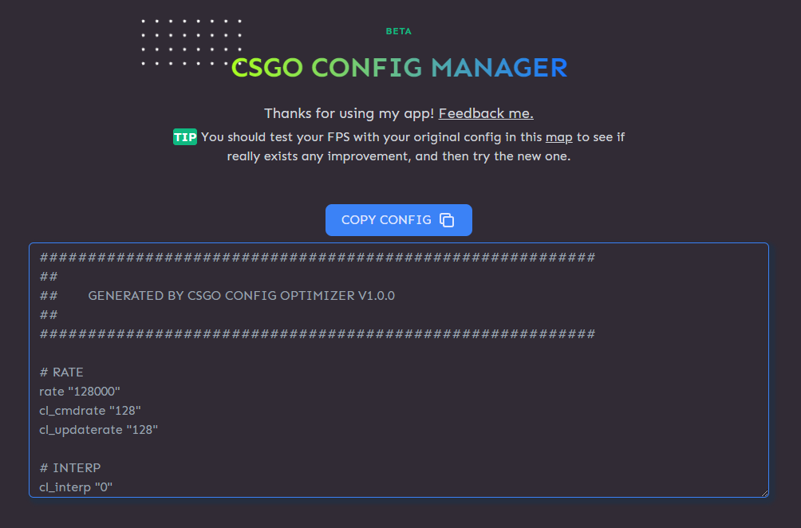

<h1 align="center">CSGO CONFIG MANAGER</h1>

</img>
</img>

# TRY IT 🚀
[CSGO CONFIG MANAGER](https://csgo-config-manager.netlify.app/)

### How it works:
This app merges the best commands for CSGO to your config to get the maximum FPS as possible, without deconfiguring your settings.

# Warning 📌
This app is in beta phase. This app may not be the best for your hardware. You should make a copy of your own config.cfg.

## Todo 📄

- [ ] Fix some bugs
- [ ] Add more commands